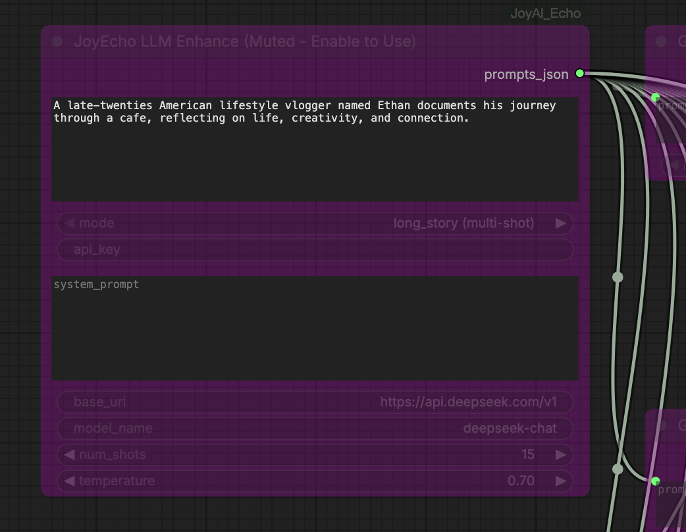

# ComfyUI_JoyAI_Echo

[JoyAI-Echo](https://github.com/jd-opensource/JoyAI-Echo) 的 ComfyUI 节点实现 —— 分钟级多镜头音视频联合生成，带配对跨模态记忆。

本实现**忠实于官方推理流程**，零精度损失。与现有社区实现的关键区别：

- **完整 bf16 精度**的文本编码器 (Gemma-3-12b) —— 无 GGUF 量化
- **正确参数**匹配官方默认值 (1280×736, 241帧, 25fps)
- **GPU 显存优化** —— 模块热切换（无画质损失）
- **内置 LLM 提示词增强** —— 通过云 API 调用（零本地显存占用）
- **逐镜头即时预览** —— 每个镜头生成后立即在 ComfyUI 中播放



## 硬件要求

- NVIDIA GPU **48GB+ 显存**（推荐 A6000/H100/A100 80GB）
  - 启用热切换：去噪阶段峰值 ~46GB
- Python 3.11+
- PyTorch 2.4+，CUDA 支持
- ffmpeg（视频拼接用）

## 安装

### 1. 克隆到 ComfyUI 自定义节点目录

```bash
cd ComfyUI/custom_nodes
git clone https://github.com/zhuang2002/ComfyUI_JoyAI_Echo.git
```

### 2. 安装依赖

```bash
cd ComfyUI_JoyAI_Echo
pip install -r requirements.txt
```

或让 ComfyUI 首次启动时通过 `install.py` 自动安装。

### 3. 下载模型权重

| 文件 | 大小 | 来源 |
|------|------|------|
| `JoyAI-Echo-release.safetensors` | ~46 GB | [HuggingFace](https://huggingface.co/jdopensource/JoyAI-Echo) |
| `gemma-3-12b-it/`（完整 bf16） | ~24 GB | [HuggingFace](https://huggingface.co/google/gemma-3-12b-it) |

放在任意可访问路径，在节点中指定路径即可。

## 节点说明

### JoyEcho Model Loader

加载所有模型组件（文本编码器、DiT 生成器、VAE）。

| 输入 | 类型 | 默认值 | 说明 |
|------|------|--------|------|
| checkpoint_path | STRING | — | `JoyAI-Echo-release.safetensors` 路径 |
| gemma_path | STRING | — | `gemma-3-12b-it` 目录路径 |
| lora_path | STRING | "" | 可选 LoRA 权重 |
| lora_strength | FLOAT | 1.0 | LoRA 强度 |
| low_vram | BOOLEAN | False | 在 CPU 上加载文本编码器（节省 ~24GB 显存） |

### JoyEcho Single Shot Generate

**核心节点** —— 逐镜头生成，每个实例有独立的提示词文本框。通过 memory 连接链式串联多个镜头。

| 输入 | 类型 | 默认值 | 说明 |
|------|------|--------|------|
| model | JOYECHO_MODEL | — | 来自 Model Loader |
| prompt | STRING | — | 单个镜头的提示词（多行文本框） |
| memory | JOYECHO_MEMORY | — | 可选，来自上一个镜头的记忆输出 |
| seed | INT | 12345 | 随机种子 |
| num_frames | INT | 241 | 每镜头帧数（必须为 1+8k） |
| video_height | INT | 736 | 视频高度 |
| video_width | INT | 1280 | 视频宽度 |
| sequential_offload | BOOLEAN | False | 逐层 GPU 卸载（24GB 显卡用） |

**输出**: IMAGE + AUDIO + MEMORY + MODEL

显存管理（自动三阶段热切换）：
1. 编码阶段：文本编码器上 GPU（~24GB），其他在 CPU
2. 去噪阶段：Generator 上 GPU（~30GB），文本编码器+VAE 在 CPU
3. 解码阶段：VAE 上 GPU，Generator+文本编码器在 CPU

### JoyEcho LLM Enhance

调用云 LLM API，将简短故事创意自动扩展为格式化的多镜头提示词。**零本地 GPU 显存占用**。

| 输入 | 类型 | 默认值 | 说明 |
|------|------|--------|------|
| story_idea | STRING | — | 故事创意（几句话描述） |
| mode | ENUM | long_story | 长故事/短故事模式 |
| api_key | STRING | — | API 密钥 |
| system_prompt | STRING | （内置默认） | LLM 系统提示词，可自定义编辑 |
| base_url | STRING | `https://api.openai.com/v1` | API 基础 URL |
| model_name | STRING | gpt-4o | LLM 模型名 |
| num_shots | INT | 0 | 生成镜头数（0=LLM自行决定） |
| temperature | FLOAT | 0.7 | 采样温度 |

支持任何 OpenAI 兼容 API（OpenAI、DeepSeek 等）。

### JoyEcho Prompt At Index

从 JSON 提示词数组中按索引提取单条提示词。连接到 SingleShot 节点的 prompt 输入可覆盖文本框内容（可选功能）。

## 工作流

### 逐镜头工作流（推荐）: `workflows/joyai_echo_per_shot.json`

```
[Model Loader] → [Shot 1] → [CreateVideo] → [SaveVideo] ← 即时预览
                    ↓ memory + model
                 [Shot 2] → [CreateVideo] → [SaveVideo] ← 即时预览
                    ↓ memory + model
                 [Shot 3] → ... (共 15 镜头)
```

- 默认 15 个镜头，使用 test_002.json 提示词初始化
- 每个镜头有独立的可编辑文本框
- 每个镜头生成后即时预览视频
- 记忆链保证角色/声音一致性
- LLM Enhance 节点默认静音，启用后可自动生成并替换所有镜头的提示词

## 测试提示词

8 个测试提示词文件位于 `prompts/` 目录：

| 文件 | 镜头数 | 描述 |
|------|--------|------|
| test_001.json | 15 | 年轻女性晚间 vlog |
| test_002.json | 15 | 咖啡馆生活感悟 |
| test_003.json | 15 | 公园散步叙事 |
| test_004.json | 15 | 厨房烹饪场景 |
| test_005.json | 15 | 图书馆学习 |
| test_006.json | 15 | 晨间日常 |
| test_007.json | 11 | 艺术工作室 |
| test_008.json | 29 | 雨天居家 |

## 致谢

- [JoyAI-Echo](https://github.com/jd-opensource/JoyAI-Echo) by Echo Team @ Joy Future Academy, JD
- [LTX-2.3](https://huggingface.co/Lightricks/LTX-2.3) by Lightricks
- [Gemma-3](https://huggingface.co/google/gemma-3-12b-it) by Google

## 许可证

仅供学术研究和非商业用途（遵循上游 JoyAI-Echo 许可证）。

---

# ComfyUI_JoyAI_Echo (English)

ComfyUI nodes for [JoyAI-Echo](https://github.com/jd-opensource/JoyAI-Echo) — minute-level multi-shot audio-video generation with paired cross-modal memory.

This implementation is **faithful to the official inference pipeline** with zero precision loss. Key differences from existing community implementations:

- **Full bf16 precision** for text encoder (Gemma-3-12b) — no GGUF quantization
- **Correct parameters** matching official defaults (1280×736, 241 frames, 25fps)
- **GPU memory optimization** via module hot-swap (no quality degradation)
- **Built-in LLM prompt enhancement** via cloud API (zero local VRAM usage)
- **Per-shot instant preview** — each shot shows a playable video in ComfyUI immediately after generation


## Requirements

- NVIDIA GPU with **48GB+ VRAM** (A6000/H100/A100 80GB recommended)
  - With hot-swap enabled: peak ~46GB during denoise phase
- Python 3.11+
- PyTorch 2.4+ with CUDA support
- ffmpeg (for video concatenation)

## Installation

### 1. Clone into ComfyUI custom_nodes

```bash
cd ComfyUI/custom_nodes
git clone https://github.com/zhuang2002/ComfyUI_JoyAI_Echo.git
```

### 2. Install dependencies

```bash
cd ComfyUI_JoyAI_Echo
pip install -r requirements.txt
```

Or let ComfyUI auto-install via `install.py` on first launch.

### 3. Download model weights

| File | Size | Source |
|------|------|--------|
| `JoyAI-Echo-release.safetensors` | ~46 GB | [HuggingFace](https://huggingface.co/jdopensource/JoyAI-Echo) |
| `gemma-3-12b-it/` (full bf16) | ~24 GB | [HuggingFace](https://huggingface.co/google/gemma-3-12b-it) |

Place them anywhere accessible. You'll provide paths in the nodes.

## Nodes

### JoyEcho Model Loader

Loads all model components (text encoder, DiT generator, VAEs).

### JoyEcho Single Shot Generate

**Core node** — generates one shot at a time with its own editable prompt text box. Chain multiple instances via the memory output for multi-shot stories.

**Inputs**: model, prompt (multiline text), memory (optional, from previous shot), seed, num_frames, video_height, video_width, sequential_offload, etc.

**Outputs**: IMAGE + AUDIO + MEMORY + MODEL

VRAM management (automatic 3-phase hot-swap per shot):
1. Encode phase: Text encoder on GPU (~24GB), everything else on CPU
2. Denoise phase: Generator on GPU (~30GB), text encoder + VAE on CPU
3. Decode phase: VAE on GPU, generator + text encoder on CPU

### JoyEcho LLM Enhance

Calls a cloud LLM API to expand a short story idea into properly formatted shot prompts. **Zero local GPU memory usage.**

- Supports any OpenAI-compatible API (OpenAI, DeepSeek, etc.)
- System prompt is fully visible and editable in the node
- Output can be connected via PromptAtIndex nodes to override shot prompts

### JoyEcho Prompt At Index

Extracts a single prompt from a JSON prompts array by index. Connect to SingleShot node's prompt input to override the text box (optional).

## Workflows

### Per-Shot Workflow (Recommended): `workflows/joyai_echo_per_shot.json`

```
[Model Loader] → [Shot 1] → [CreateVideo] → [SaveVideo] ← instant preview
                    ↓ memory + model
                 [Shot 2] → [CreateVideo] → [SaveVideo] ← instant preview
                    ↓ memory + model
                 [Shot 3] → ... (15 shots total)
```

- 15 shots pre-filled with test_002.json prompts
- Each shot has its own editable text box
- Instant video preview after each shot completes
- Memory chain ensures character/voice consistency
- LLM Enhance node muted by default; enable to auto-generate and replace all shot prompts

## Example Prompts

8 test prompt files included in `prompts/`:

| File | Shots | Description |
|------|-------|-------------|
| test_001.json | 15 | Young woman recording evening vlog |
| test_002.json | 15 | Cafe reflection story |
| test_003.json | 15 | Park walk narrative |
| test_004.json | 15 | Kitchen cooking scene |
| test_005.json | 15 | Library study session |
| test_006.json | 15 | Morning routine |
| test_007.json | 11 | Art studio session |
| test_008.json | 29 | Rainy day at home |

System prompts for LLM-based prompt writing:
- `prompts/long_story_writer_system_prompt.md` — multi-shot story generation
- `prompts/short_story_writer_system_prompt.md` — single-shot scene generation

## Acknowledgements

- [JoyAI-Echo](https://github.com/jd-opensource/JoyAI-Echo) by Echo Team @ Joy Future Academy, JD
- [LTX-2.3](https://huggingface.co/Lightricks/LTX-2.3) by Lightricks
- [Gemma-3](https://huggingface.co/google/gemma-3-12b-it) by Google

## License

For academic research and non-commercial use only (following the upstream JoyAI-Echo license).
